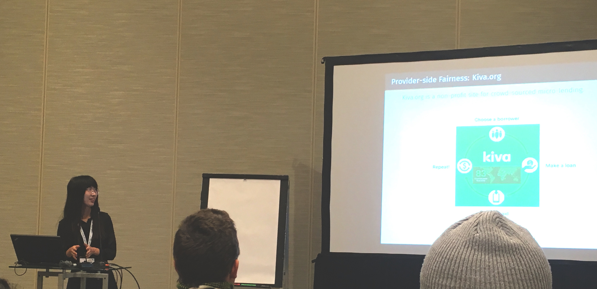

 
TRSL's research has been well represented at RecSys 2018. Here is Weiwei Liu presenting our paper "Personalizing Fairness-aware Re-ranking" at the 2nd FATRec workshop and introducing our work on provider-side fairness with Kiva.org.
