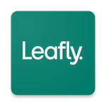

That Recommender Systems Lab is a research group in the [Department of Information Science](https://www.colorado.edu/cmci/infoscience) in the [College of Communications, Media, and Information](https://www.colorado.edu/cmci/) at the [University of Colorado, Boulder](https://www.colorado.edu/). 

Our research investigates recommender systems and other personalized systems, especially as these systems are deployed in complex and socially-sensitive settings, such as philanthropy, news, and employment. Our current projects center on multistakeholder recommendation, and in particular, fairness-aware recommendation.  

**Note that the lab is not accepting PhD applicants for admission in Fall 2025.** [Historical FAQ page is here.](http://www.that-recsys-lab.net/home/people/burke/phq-faq)

#### Sponsorship and collaboration

