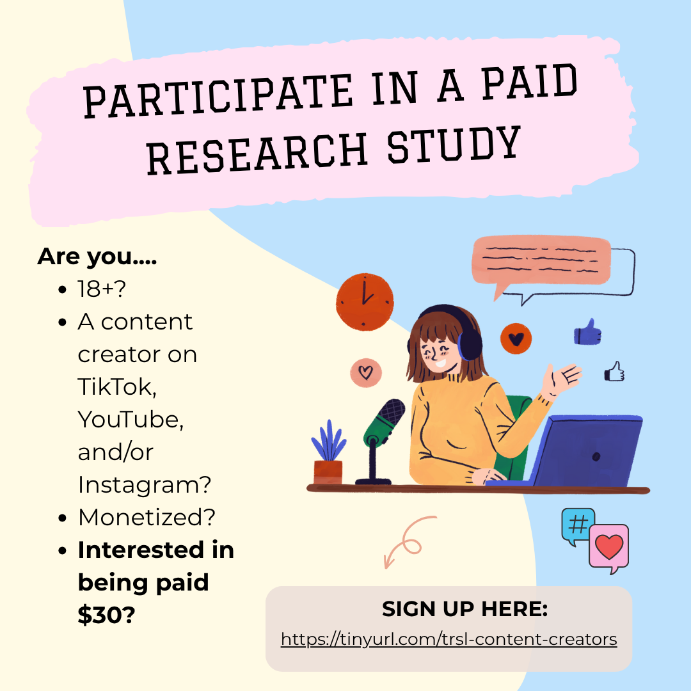

#### Join our paid research study
Are you a monetized content creator on TikTok, Instagram, or YouTube? We want to know how social media platforms show you data about how your content is recommended, and what kinds of information you would like to know from the platform!

Fill out the interest form to be considered for participation:
[Link to Interest Form](https://tinyurl.com/trsl-content-creators){: .btn}

#### More Information
##### Who are we?
The research team consists of Elizabeth McKinnie, PhD student in Information Science; Joshua Paup, PhD student in Information Science; Dr. Robin Burke, Full Professor in Information Science, and Dr. Casey Fiesler, Associate Professor in Information Science. We study recommendation algorithms, fairness, and transparency.

##### What is the study about?
We’re interested in learning more about what information social media content creators receive from the platform about how their content is recommended, what content creators think about these analytics, and how this information can be expanded on or improved.

##### Who are we looking for?
We are looking for people who are 18+ years of age, who create videos or other content for TikTok, YouTube, or Instagram, and are monetized on at least one of those platforms. 

##### What does the study entail?
You will participate in a 30-90 minute interview over Zoom with one or more members of the research team. You will be asked questions about the content you create and post on YouTube, TikTok, and/or Instagram, and about the information the platform provides you about the recommendation of your content. You will be asked to share your screen on the device you usually use and show the interviewer the information the platform provides you. Participants will be compensated for their time with a $30 Visa debit card.

##### What do you need to do?
Please fill out the form below to let us know you’re interested! Elizabeth will get in touch with you to schedule your interview, or to let you know that we have enough participants. 

Fill out the interest form to be considered for participation:
[Link to Interest Form](https://tinyurl.com/trsl-content-creators){: .btn}

